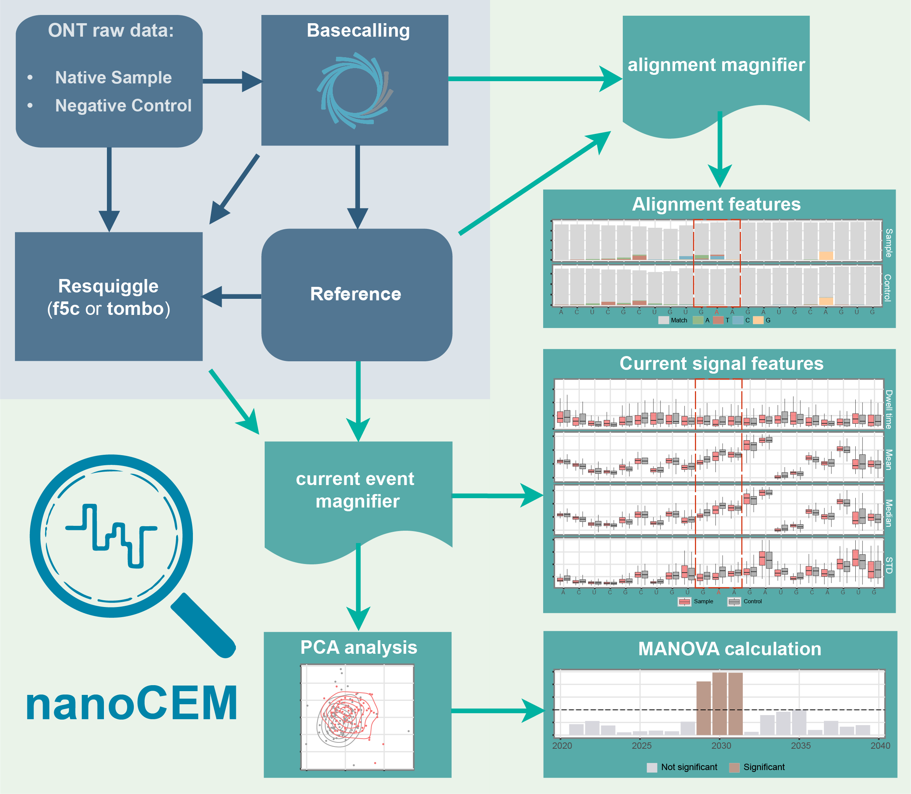

# nanoCEM 

The nanopore current events magnifier (`nanoCEM`) is a python command line to facilitate the analysis of DNA/RNA modification sites by visualizing statistical features of current events. 
NanoCEM can be used to showcase high confidence sites and observe the difference based on the modification sample and the low or no modification sample.

It supports two re-squiggle pipeline(`Tombo` and `f5c`) and support `R9` and `R10`.
If you want to view single read signal or raw signal, [Squigualiser](https://github.com/hiruna72/squigualiser) is recommended.

## Installation

Before pip install, make sure you have installed the `samtools`(>=1.16) , `f5c`(>=1.3), `slow5tools`(>=1.1.0) and `minimap2`(>=2.17),

    conda install samtools=1.16 minimap2 f5c=1.3 slow5tools -c conda-forge -c bioconda

To install the latest nanoCEM

    pip install nanoCEM

See our Installation page for details. 

To check the version of nanoCEM, run:

    pip list | grep nanoCEM

 **Notes:** Additionally, we do not rely on any re-squiggle or eventalign packages. We only need their index files for the sequencing data.

## Data release
For the data we used and related commands in our paper, please view our [wiki](https://github.com/lrslab/nanoCEM/wiki/Data-release-and-commands)

## Documents
Full documentation is available at https://nanocem.readthedocs.io/

## Workflow

