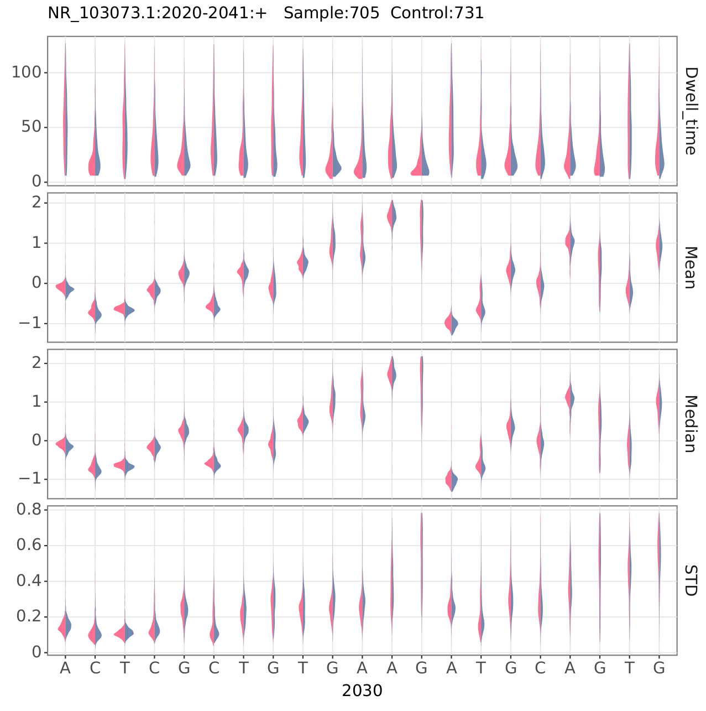
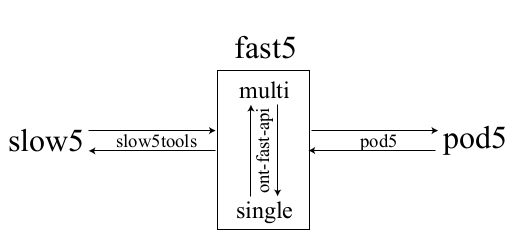

# nanoCEM
The nanopore current events magnifier (`nanoCEM`) is a python command line to facilitate the analysis of DNA/RNA modification sites by visualizing statistical features of current events. 
CEM can be used to showcase high confidence sites and observe the difference based on the modification sample and the low or no modification sample.

It supports two re-squiggle pipeline(`Tombo` and `f5c`) and support `R9` and `R10`.
If you want to view single read signal or raw signal, [Squigualiser](https://github.com/hiruna72/squigualiser) is recommended.

## Example
Here is an example to help the user confirm the installation of A2030 on 23S rRNA:
```sh
pip install nanoCEM
git clone https://github.com/lrslab/nanoCEM
cd nanoCEM/example
# tackle f5c result
current_events_magnifier.py f5c -i data/wt/file -c data/ivt/file -o f5c_result \
--chrom NR_103073.1 --strand + \
--pos 2030 \
--ref data/23S_rRNA.fasta \
--base_shift 2 --rna --norm
# tackle tombo result
current_events_magnifier.py tombo -i data/wt/single -c data/ivt/single -o tombo_result \
--chrom NR_103073.1 --strand + \
--pos 2030 \
--ref data/23S_rRNA.fasta \
--rna --cpu 4 --norm
```
Then you can generate the following pdf files.



## Data release
For the data we used and related commands in our paper, please view our [wiki](https://github.com/lrslab/nanoCEM/wiki/Data-release-and-commands)
## Before start, you should know
### Re-squiggle
In ONT technology, "resquiggle" refers to the process of converting the raw electrical signals from the sequencer into corresponding DNA/RNA sequence information, which is then corrected and realigned. 
This process utilizes the signal features of ONT sequencing, such as changes in electrical resistance and noisy signals, to capture information from the DNA/RNA sequence and analyze and interpret it. 
Although new basecaller program (Guppy/Boinito/Dorado) generated the bam file with move table to record the event index,but  resquiggle is a more fine alignment than the move table in most cases.
### Data format
Since the release of the R10, ONT's data formats have become more diverse, including the initial fast5 format, the new pod5 format, and community-provided slow5/blow5 formats. The relationship between them and conversion tools are shown in the following figure.



In our program, we assume that the input provided by the user is the **multi-fast5** format by default.
### Reference and alignment
For RNA showcase, the expected input for the vast majority of species is a fasta file of transcripts, rather than the genome. 
This is because RNA undergoes splicing and other phenomena after transcription, allowing a single gene to produce multiple different transcripts with varying splicing forms and exon compositions.
### Base shift (only available for f5c)
The mechanism of tombo and f5c is different, f5c applied a k-mer model, which means base should satisfy at least 4 bases before it.
For example, in CTAT**G**, f5c will only return the last **G**'s current event.So, compared to tombo, there is always an offset in the results of f5c. 
In order to make the results of the two methods comparable and draw similar conclusions, we recommend using an offset of **2** maintained a distance no greater than **1** base compared with Tombo (default : **2**). However, if you trust the original input, you can set the offset to **0**.
## Installation
Requirement : Python >=3.7, <3.10
```sh
pip install nanoCEM==0.0.2.0
```

Other tools if you needed
```sh
pip install ont-fast5-api pod5
conda install -c bioconda f5c slow5tools minimap2 samtools
```
## Options
### read_tombo_resquiggle
```sh
current_events_magnifier.py tombo -h
optional arguments:
  -h, --help            show this help message and exit
  --basecall_group BASECALL_GROUP
                        The attribute group to extract the training data from. e.g. RawGenomeCorrected_000
  --basecall_subgroup BASECALL_SUBGROUP
                        Basecall subgroup Nanoraw resquiggle into. Default is BaseCalled_template
  -i FAST5, --fast5 FAST5
                        fast5_file
  -c CONTROL_FAST5, --control_fast5 CONTROL_FAST5
                        control_fast5_file
  -o OUTPUT, --output OUTPUT
                        output_file
  --chrom CHROM         Gene or chromosome name(head of your fasta file)
  --pos POS             site of your interest
  --len LEN             region around the position (default:10)
  --strand STRAND       Strand of your interest (default:+)
  -t CPU, --cpu CPU     num of process (default:8)
  --ref REF             fasta file
  --overplot-number OVERPLOT_NUMBER (default:500)
                        Number of read will be used to plot
  --rna                 Turn on the RNA mode 
  --norm                Turn on the normalization
```
### read_f5c_resquiggle
```sh
current_events_magnifier.py f5c -h
optional arguments:
  -h, --help            show this help message and exit
  -i INPUT, --input INPUT
                        path and suffix of blow5, bam file and paf files
  -c CONTROL, --control CONTROL
                        control path and suffix of blow5, bam file and paf files
  -o OUTPUT, --output OUTPUT
                        output_file
  --chrom CHROM         Gene or chromosome name(head of your fasta file)
  --pos POS             site of your interest
  --len LEN             region around the position (default:10)
  --strand STRAND       Strand of your interest (default:+)
  --ref REF             fasta file
  --overplot-number OVERPLOT_NUMBER (default:500)
                        Number of read will be used to plot
  --rna                 
                        Turn on the RNA mode
  --base_shift BASE_SHIFT
                        base shift if required (default:2)
  --norm                Turn on the normalization
```
## Quick start
### 1. Run Basecaller and alignment on your ONT data
```sh
# assumed your fast5 file folder name is fast5/ and reference is reference.fasta
# q 30 is recommended but you can try other filter in your data
guppy_basecaller -i fast5/ -s ./guppy_out --recursive --device auto -c rna_r9.4.1_70bps_hac.cfg  &
cat guppy_out/*/*.fastq > all.fastq
minimap2 -ax map-ont -t 16 --MD reference.fasta all.fastq | samtools view -hbS -F 260 -q 30 - | samtools sort -@ 16 -o file.bam
samtools index file.bam
```
Option ```-c``` means config file ,which will depend on your data
### 2. Decide the chrom or transcript name and region of your interest
In this sample, I plot the 23s rRNA whose header in fasta file is NR_103073.1 and I am intereted in A2030 on the plus strand.
So for the following command , I used ```--chrom NR_103073.1  --pos 2030 --strand +```.
### 3. Subsample (Optional)
Re-squiggle is a really time-consuming program, it will be applied on all reads not only the reads around interest region.
So I provide a simple py file to help extract the reads you want to visualize.
And the new reads will be copied to ```subsample_single/```
```sh
multi_to_single_fast5 -i fast5/ -s single/ --recursive -t 16
extract_sub_fast5_from_bam.py -i single/ -o subsample_single/ -b file.bam --chrom NR_103073.1 --pos 2030 
```
### 4 Re-squiggle
#### 4.1 Tombo resquiggle (v1.5.0)
Step 1 and 2 should run on your two sample respectively, before the step 5.
1. Data format conversion

If you did the subsample,skip this step and used ```subsample_single``` as the following input rather than ```single/```
```sh
# assumed your fast5 file folder name is fast5/
multi_to_single_fast5 -i fast5/ -s single/ --recursive -t 16
```
2. Run tombo resquiggle
```sh
# if fast5 is not single format need to transfer to single format by ont-fast-api
# single is fast5s-base-directory

tombo preprocess annotate_raw_with_fastqs --fast5-basedir  single/ --fastq-filenames all.fastq --processes 16 
tombo resquiggle single/ reference.fasta --processes 16 --num-most-common-errors 5
# Notes:
# Tombo resquiggle will take various of time, which means subsample your aligned reads of the special region is recommended
# Run the Tombo pipeline above for your two sample respective, the SSD disk is recommended 
# If you ran step2, run the tombo command on subsample_single but single
```
3. Run current_events_magnifier to plot
```sh
# tackle tombo result
current_events_magnifier.py tombo -i data/wt/single -c data/ivt/single -o tombo_result \
--chrom NR_103073.1 --strand + \
--pos 2030 \
--ref data/23S_rRNA.fasta \
--rna --cpu 4 --norm
```
#### 4.2 F5c resquiggle (v1.2) (support R10)
Step 1 and 2 should run on your two sample respectively, before the step 3.
1. Data format conversion.
If you did the subsample,skip this step and used ```subsample_single``` as the following input rather than ```fast5/```
```sh
slow5tools f2s fast5/ -d blow5_dir
slow5tools merge blow5_dir -o file.blow5
slow5tools index file.blow5
```
2. Run f5c resquiggle

Use ```--rna``` to turn to the rna mode and ```--pore r10``` to re-squiggle reads from R10
```sh
f5c resquiggle -c all.fastq file.blow5 -o file.paf --rna --pore r9
```
3. Run nanoCEM to plot
```sh
# run the pipeline below for your two sample respective and keep the suffix of bam/paf/blow5 is the same
current_events_magnifier.py f5c -i data/wt/file -c data/ivt/file -o f5c_result \
--chrom NR_103073.1 --strand + \
--pos 2030 \
--ref data/23S_rRNA.fasta \
--base_shift 2 --rna --norm
```


