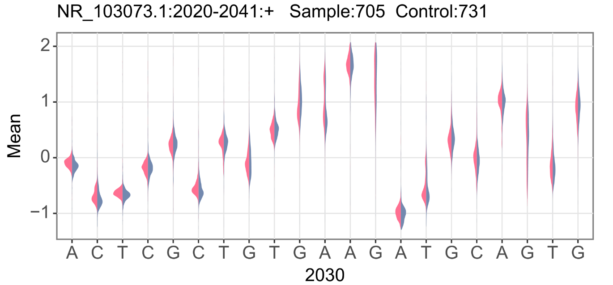

# Current_Magnifier
`Current_Magnifier` is a sample tool designed to visualize the features(Mean,Median,Dwell_time,STD) that distinguish between two groups of ONT data from the same species at the site level.
It supports two re-squiggle pipeline(`Tombo` and `f5c`). From R9 to R10, Tombo/nanopolish/f5c applied different method to optimise the alignment. So, this program can examine the differences in the current generated by ONT at the same site across multiple dimensions, making it easier for researchers to showcase and demonstrate their discoveries of mutations and modifications.
If you want to view single read signal or raw signal, [Squigualiser](https://github.com/hiruna72/squigualiser) is recommended.
## Example
Here is an example that show the difference of A2030 on 23S rRNA.


## Still developing
### TO do list
1. RNA splicing 
2. More normalization methods (finished)
3. Test on minus strand or reversed strand (finished)
4. Subsample coverage
5. single mode
6. merge images together
## What is re-squiggle
In ONT technology, "resquiggle" refers to the process of converting the raw electrical signals from the sequencer into corresponding DNA/RNA sequence information, which is then corrected and realigned. 
This process utilizes the signal features of ONT sequencing, such as changes in electrical resistance and noisy signals, to capture information from the DNA/RNA sequence and analyze and interpret it. 
Although new basecaller program (Guppy/Boinito/Dorado) generated the bam file with move table to record the event index,but  resquiggle is a more fine alignment than the move table in most cases.


## Quick start
### Preprocessing
If you used R10 or want to use the last resquiggle program(f5c v1.2.0),
```sh
# if fast5 is single format 
# single is fast5s-base-directory
single_to_multi_fast5 -i single/ -s multi -n 1000 --recursive

slow5tools f2s multi/ -d blow5_dir
slow5tools merge blow5_dir -o file.blow5
slow5tools index file.blow5

minimap2 -ax map-ont -t 16 --MD <reference-fasta> <reads.fastq> | samtools view -hbS -F 260 - | samtools sort -@ 6 -o file.bam
samtools index file.bam

f5c resquiggle -c final.fastq file.blow5 -o file.paf

# run the pipeline below for your two sample respective and keep the suffix of bam/paf/blow5 is the same
python read_f5c_resquiggle.py -i wt/file -c control/file -o f5c_result --chrom NC_000xxx --strand + --pos 3929 --len 5 --ref reference.fa

```
If you used Tombo(v1.5.0),
```sh
# if fast5 is not single format need to transfer to single format by ont-fast-api
# single is fast5s-base-directory

tombo preprocess annotate_raw_with_fastqs --fast5-basedir  single/ --fastq-filenames <reads.fastq>

tombo resquiggle single/ <reference-fasta> --processes 4 --num-most-common-errors 5
# run the pipeline below for your two sample respective, the SSD disk is recommended 
python read_tombo_resquiggle.py -i wt/single -c control/single -o tombo_result --chrom NC_000xxx --strand + --pos 3929 --len 5 --cpu 4 --ref reference.fa

```


