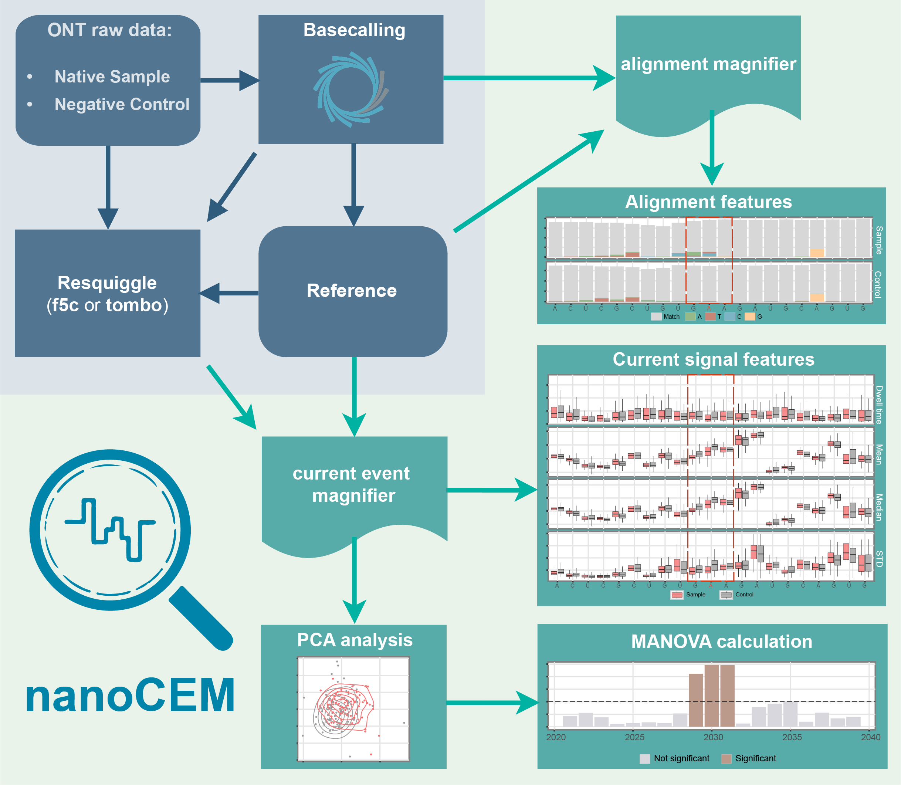

# nanoCEM 
<a href="https://pypi.python.org/pypi/nanoCEM" rel="pypi"> </a>
<a href="https://opensource.org/license/mit/" rel="license"></a>

The nanopore current events magnifier (`nanoCEM`) is a python command line to facilitate the analysis of DNA/RNA modification sites by visualizing statistical features of current events. 
NanoCEM can be used to showcase high confidence sites and observe the difference based on the modification sample and the low or no modification sample.

It supports two re-squiggle pipeline(`Tombo` and `f5c`) and support `R9` and `R10`.
If you want to view single read signal or raw signal, [Squigualiser](https://github.com/hiruna72/squigualiser) is recommended.

## Installation
```
python setup.py install
```

## file requirement

    data/
    ├── wt/
    │   └── file.blow5  # blow5 fil
    │   └── file_aligned.bam  # BAM file
    │   └── file_aligned.paf  # PAF file 
    ├── ivt/
    │   └── file.blow5  # blow5 fil
    │   └── file_aligned.bam  # BAM file
    │   └── file_aligned.paf  # PAF file 
    └── 23S_rRNA.fasta  # reference fasta file

## Test
```
cd example
current_events_magnifier f5c_ev -i data/wt/file -c data/ivt/file --chrom NR_103073.1 --strand + --pos 2030 --ref data/23S_rRNA.fasta -o nanoCEM_result_f5c_ev_test --rna --norm --sample_aligned_file data/wt/file_aligned --control_aligned_file data/ivt/file_aligned
```

## Solutions for some potential environment problem
Although it does not affect the functionality, the issue of possible missing header files caused by **samtools** installation by conda can be resolved with the following command.

    conda install -c conda-forge ncurses

The potential **vbz** format compression issue when reading **fast5** files.

    conda install -c bioconda ont_vbz_hdf_plugin


## Data release
For the data we used and related commands in our paper, please view our [wiki](https://github.com/lrslab/nanoCEM/wiki/Data-release-and-commands)

## Documents
Full documentation is available at https://nanocem.readthedocs.io/

## Publication
Our paper is online [here](https://academic.oup.com/nargab/article/6/2/lqae052/7676831) now

## Workflow

