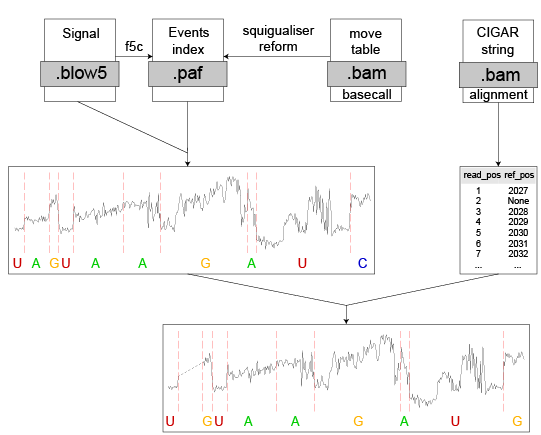

#  Adaption for preprocessing methods

## Introduction
nanoCEM now supports four alignment methods for nanopore signal: `f5c resquiggle`, `f5c eventalign`, `move_table` from basecaller, and `tombo resquiggle`.

While `tombo resquiggle` and `f5c eventalign` align the signals to the reference sequence,
`f5c resquiggle` and `move_table` from basecaller are alignment methods applied to the basecalled sequence.
Thus,these basecalled sequence methods require additional adaptions to index the reference sequence.

## Basecalled sequence methods adaption

### Signal index file acquisition
For `f5c resquiggle`, a **paf** (Pairwise Alignment Format) file is generated, 
which records the alignment information and indices corresponding to the basecalled sequence. 

On the other hand, the `move_table` is stored in the **bam** file generated from the basecaller, 
for the related decoding and indexing methods, detailed description is [here](https://github.com/hiruna72/squigualiser/blob/main/docs/move_table.md).
To address this issue, we utilized the `squigualiser reform` tool available in the repository [**here**](https://github.com/hiruna72/squigualiser/blob/main/docs/reform.md)  to generate the `PAF` file.

### Re-indexing on the reference sequence
For such methods, we align the basecalled sequence to the reference by using the **CIGAR values** from the **bam** file to generate an **index table**. 
This process involves discarding **insertions** and **deletions** while preserving **mismatches** to accurately map the basecalled sequence onto the reference.

 

## Base shift (only for f5c)

For `f5c` (both for `resquiggle and eventalign`), during nanopore signal alignment, it utilizes a **k-mer model** and assigns the alignment result to the **first base**. However, this is not the case for `tombo resquiggle` and `move_table`.
Their developers noticed this issue and applied a complicated strategy to tackle it in this [link](https://github.com/hiruna72/squigualiser/blob/main/docs/base_shift_and_eventalignment.md).

But in nanoCEM, to make their results as consistent as possible and enable comparisons with `tombo` and `move_table`, 
we introduced `--base_shift` option to align the result closer to the most contributing base, and shift num is recorded [here](https://github.com/hiruna72/squigualiser/blob/main/docs/profiles.md)

The default value for --base_shift is **auto**. However, if you want to disable it, you can use **--base_shift 0**. If you want to shift by a different number, please enter a negative value, for example,
**--base_shift -3**. Please note that for RNA mode, the shift will be from **3'** to **5'**, so the value should also be a **negative number**.
