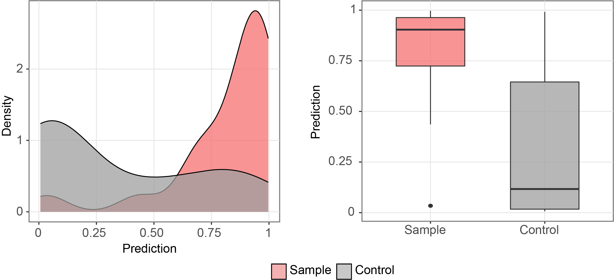

# An example for deeper application

After observing significant differences in the results of Principal Component Analysis (PCA), 
it is possible to train models specifically on the features of interest. Here, I will provide 
an example of training a model using **XGBoost** for the `current_feature.csv` from **nanoCEM**.

## Prepare the data feature

In the current k-mer based RNA modification detection algorithms (such as nanom6A, xPore ...), most of them utilize 5-mer algorithms. 
We provide the function `extract_kmer_feature(result_df, kmer_number,target_position)` to extract kmer feature from our output file and the example is as below

    import numpy as np
    import pandas as pd
    from  nanoCEM.cem_utils import  extract_kmer_feature
    df = pd.read_csv('current_feature.csv')
    # extract_kmer_feature(result_df, kmer_number,target_position)
    feature_matrix, label = extract_kmer_feature( df, 5, 2030)
    label[0] = label[0].apply(lambda x: 1 if x == 'Sample' else 0)

## Train and test
Perform k-fold cross-validation using XGBoost and calculate the average accuracy.

    from sklearn.metrics import accuracy_score
    from sklearn.model_selection import KFold

    X = feature_matrix.values
    y = label.values
    kfold = KFold(n_splits=5)
    # Perform k-fold cross-validation
    accuracy_scores=[]

    for train_index, test_index in kfold.split(X):
        # Split the data into training and testing sets for each fold
        X_train, X_test = X[train_index], X[test_index]
        y_train, y_test = y[train_index], y[test_index]
    
        # Create an XGBoost classifier
        model = xgboost.XGBClassifier()
    
        # Train the model on the training data
        model.fit(X_train, y_train)
    
        # Make predictions on the testing data
        y_pred = model.predict(X_test)
    
        # Calculate the accuracy score
        accuracy = accuracy_score(y_test, y_pred)
    
        # Store the accuracy score for this fold
        accuracy_scores.append(accuracy)
    
        # Calculate the average accuracy across all folds
    avg_accuracy = sum(accuracy_scores) / len(accuracy_scores)
    print(avg_accuracy)

## Density plot
After obtaining the trained model, it is possible to visualize the distribution of the test data using tools like plotnine as below.

    prediction_df = pd.DataFrame({'y_test': y_test.reshape(-1,), 'y_pred': y_pred})
    prediction_df['y_test'] = prediction_df['y_test'].apply(lambda x: 'Sample' if x==1 else 'Control')
    import plotnine as p9
    category = pd.api.types.CategoricalDtype(categories=['Sample', "Control"], ordered=True)
    prediction_df['y_test'] = prediction_df['y_test'].astype(category)
    # visualize the first prediction's explanation
    plot = p9.ggplot(prediction_df, p9.aes(x='y_test', y="y_pred",fill='y_test')) \
                +p9.scale_fill_manual(values={"Sample": "#F57070", "Control": "#9F9F9F", "Single": "#a3abbd"})\
               + p9.theme_bw() \
               + p9.labs(x='',y='Prediction')\
               + p9.geom_boxplot(width=0.6,alpha=0.7)\
               + p9.theme(
            figure_size=(4, 4),
            panel_grid_minor=p9.element_blank(),
            axis_text=p9.element_text(size=13),
            axis_title=p9.element_text(size=13),
            title=p9.element_text(size=13),
            legend_position='none',
            legend_title=p9.element_blank(),
            strip_text=p9.element_text(size=13),
            strip_background=p9.element_rect(alpha=0),
        )
    print(plot)

    
For example, in the figure below:

    
