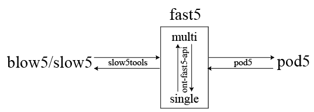

# Data preparation from raw reads

## Raw data from Oxford Nanopore Technologies sequencing

With the introduction of R10.4.1 flowcell, the diversity of ONT data formats has increased. 
These now include the original single and multiple fast5 format, the newer pod5 format,
and the community-driven slow5/blow5 formats. The relationship between and conversion tools 
between these different data formats is as below

 
 

nanoCEM only support single-format `fast5` and `blow5`, please transfer the data format before usage.
Since we support `tombo` and `f5c`, where `tombo` only supports single format `fast5` and `f5c` supports `blow5`,
you only need to choose one from them.
Here are some advices commands if your original data is multi-format fast5

    # ont-fast5-api
    multi_to_single_fast5 --input_path </path/to/multi_reads> --save_path </path/to/single_reads> --recursive
    # slow5tools
    slow5tools f2s </path/to/multi_reads> -d </path/to/blow5_dir>
    slow5tools cat </path/to/blow5_dir> -o file.blow5

## Basecall your raw reads
After obtaining raw reads files, the first step is to basecall them.
Here is an example script to run Guppy and Dorado basecaller. You can find more detail about basecalling at ONT:

    # Guppy basecaller
    guppy_basecaller -i <path/to/fastt> -s <path/to/fastq> --config <config file> --device auto -r
    cat <path/to/fastq> > final.fastq
    # Dorado basecaller (support fast5 & pod5)
    dorado basecaller <model> </path/to/reads> > dorado.bam
    samtools bam2fq dorado.bam > final.fastq

## Choose your reference
The alignment of DNA is relatively simple, but for RNA, it becomes more complex due to the presence of 
alternative splicing and multiple isoforms in eukaryotic organisms. 

The alignment process is already embedded in nanoCEM. For general analysis, if you use RNA mode,
it is advisable to use `transcript` as the reference, while for DNA, the reference would be the `genome`.

## Re-squiggle process
nanoCEM supports the re-squiggle results of both `tombo` and `f5c`.
### f5c
f5c is a software that supports eventalign and also supports the new R10 data. 
We recommend using version 1.2 or above. Here are the sample commands for dna/rna from different flowcell.

    # for rna data from r9 flowcell
    f5c resquiggle -c final.fastq file.blow5 -o file.paf --rna --pore r9
    # for dna data from r10 flowcell
    f5c resquiggle -c final.fastq file.blow5 -o file.paf  --pore r10

### tombo
Tombo is a suite of tools primarily for the identification of modified nucleotides from nanopore sequencing data, and firstly proposed
the generation of re-squiggle.

    tombo preprocess annotate_raw_with_fastqs --fast5-basedir  </path/to/single_reads> --fastq-filenames final.fastq --processes 16 
    tombo resquiggle </path/to/single_reads> reference.fasta --processes 16 --num-most-common-errors 5