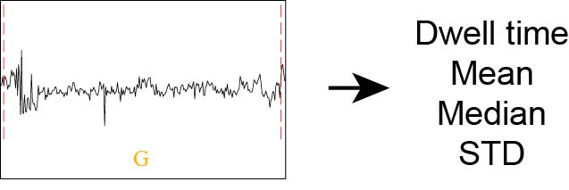

# Description of statistical features

Several statistics are available for output for two text outputs from nanoCEM:

`alignment_feature.csv` and `current_feature.csv`

## alignment_feature

* `Coverage` : The coverage level for mapped reads
* `Match` : Reads that have the same base (A, T, C, or G) as the reference at the current position.

## current_feature

The nanoCEM will caculate four features (Dwell time, Mean, Median, and STD) for each read at every reference base like below

  

* `Dwell time` :  The duration that a molecule spends passing through a nanopore .
* `Mean` : The mean signal level mapped to this location is also referred to as `current intensity`.
* `Median` : The median signal level  mapped to this location.
* `STD` : Standard deviation of signal level mapped to this location.