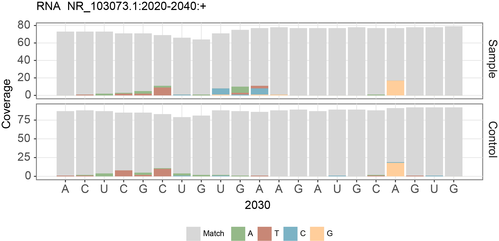
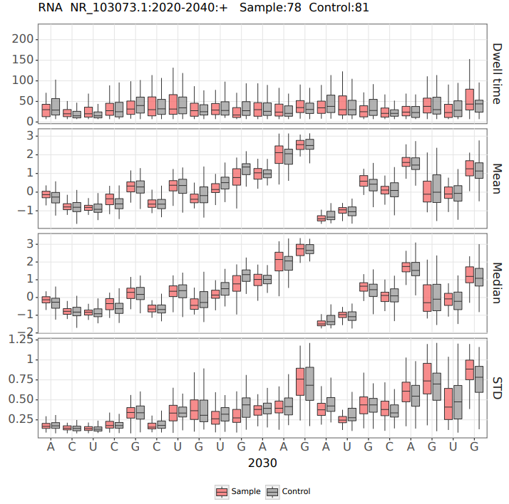
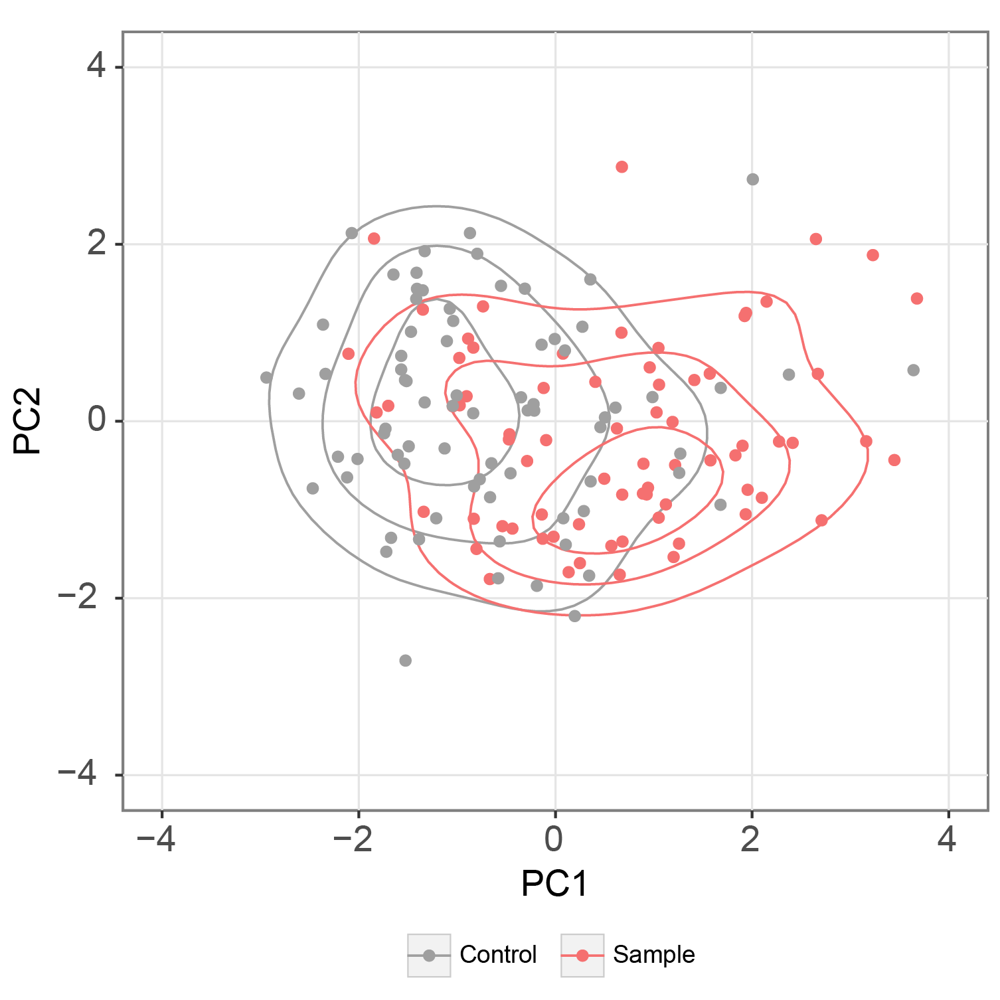

# Quick start

This quick start guide outlines the steps to use the nanoCEM command line for analyzing our example data, which consists
of the E. coli 23S rRNA around a known m6A site(A2030). nanoCEM will calculate alignment features and current event
features within this specified region.

If you want to deal DNA data, remember to delete all `--rna` in the following commands

## Dataprep

Before utilizing NanoCEM, it is required to convert the raw data format to the appropriate format(single-format `fast5`
or `blow5`) and perform basecalling to obtain a `fastq` file. Subsequently, select a suitable reference `fasta` file
based on research requirements and proceed with the re-squiggle process using either `tombo` or `f5c`.

For more details and commands, please refer to the [Data preparation from raw reads](preparation.md) page.

## Download the example data

    git clone https://github.com/lrslab/nanoCEM
    cd nanoCEM/example

The path to the downloaded data is as follows:

    data/
        wt/
            file.blow5  # blow5 file for f5c re-squiggle
            file.blow5.idx  # index file of blow5 file
            file.paf    # result file from f5c
            file.fastq # basecall result file
            single/ # single-format fast5 files for tombo re-squiggle
        ivt/
            file.blow5  # blow5 file for f5c re-squiggle
            file.blow5.idx  # index file of blow5 file
            file.paf    # result file from f5c
            file.fastq # basecall result file
            single/ # fast5 files for tombo re-squiggle
        23S_rRNA.fasta  # reference fasta file
        23S_rRNA.fasta.fai  # index file of fasta file
        ...     

## Alignment feature visualization

To compare two samples' alignment feature, provide their `fastq` file , reference file and specific position , here is a
script using our test data to visualize the alignment feature,

    # get alignment visualization 
    alignment_magnifier -i data/wt/file.fastq  -c data/ivt/file.fastq  --output nanoCEM_result \
    --chrom NR_103073.1 --pos 2030 --len 10 --strand + \
    --rna --ref data/23S_rRNA.fasta 

Then nanoCEM will output the alignment feature table called [`alignment_feature.csv`](output_format.md) and figure in
your interest region as below,

 

## Current event feature visualization

For the current event feature, we provide  `current_events_magnifier` script. You can choose the re-squiggle program
from `f5c` and `tombo`. They are different in several aspects, including the re-squiggle algorithm
(which may introduce one base bias) and the supported data types (fast5/blow5). 

If you choose `f5c`, make sure that the prefix of `fastq`, `blow5`,`paf` should be same
for each group like below,

    test/
        file.blow5  
        file.blow5.idx  
        file.paf   
        file.fastq

Then you can use `current_events_magnifier` as below,

    # tackle f5c result
    current_events_magnifier f5c -i data/wt/file -c data/ivt/file -o f5c_result \
    --chrom NR_103073.1 --strand + \
    --pos 2030 \
    --ref data/23S_rRNA.fasta \
    --base_shift 2 --rna --norm

Then nanoCEM will output the current feature called [`current_feature.csv`](output_format.md) of your interest region
and plot it as below,

 

Meanwhile, to visually display the differences in current features of selected data points between two groups, the
selected points(A2030) within each group can be subjected to Principal Component Analysis (PCA).

 

In addition to `f5c`, nanoCEM also supports `tombo`, and achieve the same functionality by providing the fast5 folder
like the following commands,

    # tackle tombo result
    current_events_magnifier tombo -i data/wt/single -c data/ivt/single -o tombo_result \
    --chrom NR_103073.1 --strand + \
    --pos 2030 \
    --ref data/23S_rRNA.fasta \
    --rna --cpu 4 --norm