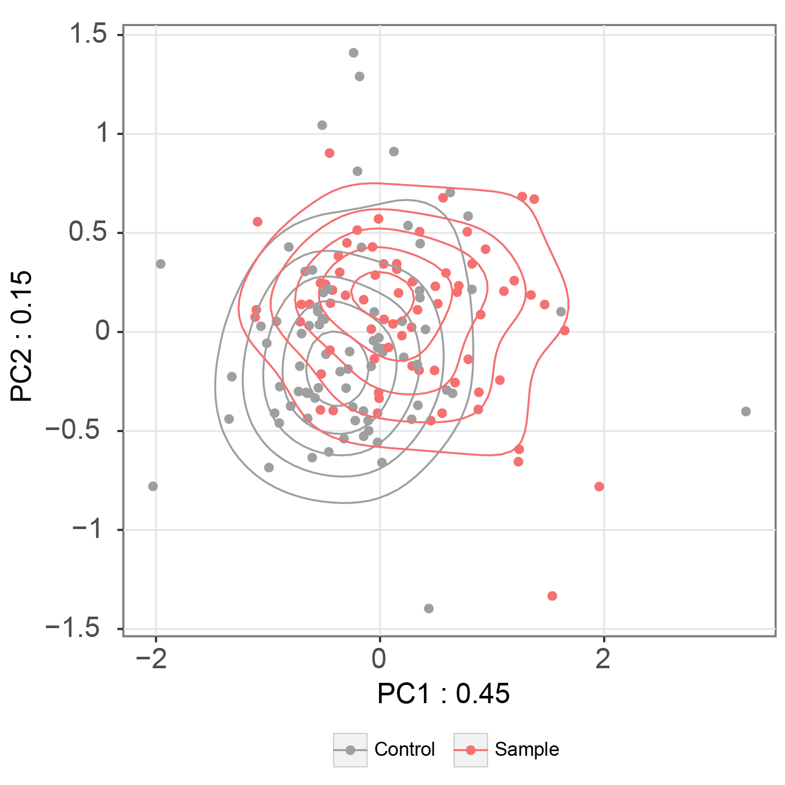
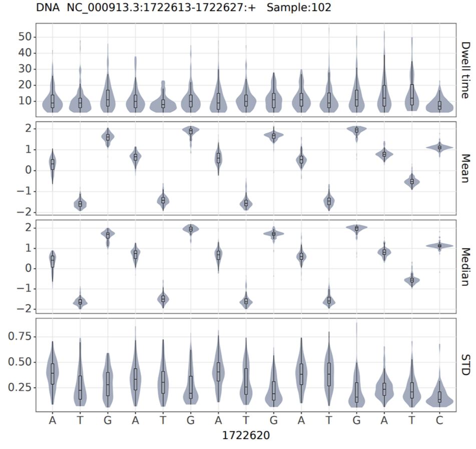

# Quick start

This quick start guide outlines the steps to use the nanoCEM command line for analyzing our example data, which consists
of the _E. coli_ 23S rRNA around a known m6A site (A2030). nanoCEM will calculate alignment features and current event
features within this target region.

## Download the example data

    git clone https://github.com/lrslab/nanoCEM
    cd nanoCEM/example

The path to the downloaded data is as follows:

    data/
    ├── wt/
    │   └── file.blow5  # blow5 file for f5c eventalign
    │   └── file.fastq # basecall result file
    │   └── basecall.blow5  # blow5 file for move_table
    │   └── basecall.bam  # blow5 file for move_table
    │   └── single/  # single-format fast5 files for tombo re-squiggle
    ├── ivt/
    │   └── file.blow5  # blow5 file for f5c eventalign
    │   └── file.fastq # basecall result file
    │   └── basecall.blow5  # blow5 file for move_table
    │   └── basecall.bam  # blow5 file for move_table
    │   └── single/  # single-format fast5 files for tombo re-squiggle
    └── 23S_rRNA.fasta  # reference fasta file

## Data preparation

[comment]: <> (Before utilizing NanoCEM, it is required to convert the raw data format to the appropriate format &#40;single-format `fast5`)

[comment]: <> (or `blow5`&#41; and perform basecalling to obtain a `fastq` file. Subsequently, select a suitable reference `fasta` file)

[comment]: <> (based on research requirements and proceed with the re-squiggle process using either `tombo` or `f5c`.)
Before utilizing nanoCEM, it is required to convert the raw data format to the appropriate format **blow5** and 
perform basecalling to obtain a **fastq** file. Subsequently, select a suitable reference **fasta** file.
The current ONT default output is the **pod5** format, here is a script to transfer,
    
    # install package
    pip install blue-crab

    # blow5 to blow5
    blue-crab p2s file.pod5 -o file.blow5

For more details and commands, please refer to the [Data preparation from raw reads](preparation.md) page.

## Alignment feature visualization

To compare two groups' alignment feature, their **fastq** files, reference **fasta** file and the target position are required.Here is a
script using our test data to visualize the alignment feature,

    # get alignment visualization 
    alignment_magnifier -i data/wt/file.fastq  -c data/ivt/file.fastq  \
    --chrom NR_103073.1 --pos 2030 --len 10 --strand + \
    --rna --ref data/23S_rRNA.fasta --output nanoCEM_result

Then nanoCEM will output the alignment feature table called [**alignment_feature.csv**](output_format.md#result-file-from-alignment_magnifier) and figure in
your target region as below, **Sample** is from `-i` and **Control** is  `-c`

 

## Current event feature visualization
For the current event feature, `current_events_magnifier` script is provided to visualize and analyse related feature.
Our default mode is based on `f5c resquiggle`, so our framework integrated the `f5c` commands.
In addition, nanoCEM also supports preprocessing result from [`f5c eventalign`](#f5c-eventalign-support), [`tombo`](#tombo-support) and  [`move_table`](#move_table-support)from nanopore basecaller.

**Notes:**  For `tombo`, although we have added support for it, you will need to set up the additional `tombo` environment and run **tombo resquiggle** command. 

### f5c support (Default)

#### Introduction
There are two modes in `f5c`, namely `resquiggle` and `eventalign`. 
We have adapted both modes for our analysis and utilized the `f5c resquiggle`  as our default preprocessing method.

#### Data preparation

Please make sure that the prefix of **fastq**, **blow5** should be the same
for each group (Sample and Control) just like below,

    root
    ├── Sample
    │   └── file.blow5
    │   └── file.fastq
    ├── Control
    │   └── file.blow5
    │   └── file.fastq

#### current_events_magnifier
We have already organized our sample data, so we just need to run the `current_events_magnifier` script as below,

    # run f5c resquiggle mode
    current_events_magnifier f5c_re -i data/wt/file -c data/ivt/file \
    --chrom NR_103073.1 --strand + --pos 2030 \
    --ref data/23S_rRNA.fasta -o nanoCEM_result_f5c_re \
    --base_shift --rna --norm

 **Notes:** 
If you want to work with DNA data, please remember to remove the `--rna` option from your commands.
To use the r10 mode instead of the default `r9` mode, add the `--pore r10` option.
Additionally, you can enable base shift and normalization by using the `--base_shift` and `--norm` options.
For more details, you can refer to the [command documentation](argument.md).

Then nanoCEM will output the current feature called [**current_feature.csv**](output_format.md#result-file-from-current_event_magnifier) of your target region
and plot it as below,

 

Meanwhile, to visually display the differences in current features of target position (A2030) between two groups, the
3-mer's feature will be collected within each group can be subjected to Principal Component Analysis (PCA).

 

Finally, in order to demonstrate the difference in current between each point in the target region, we utilized MANOVA to analyze 
the results of PCA and determine the presence of statistically significant differences. **MANOVA_result.csv** and the figure below will be saved in the 
output path.

 

#### f5c eventalign support

The data preparation and command for applied the preprocing method `f5c eventalign` are exactly the same as for `f5c resquiggle`, 
except that the `f5c_ev` option needs to be used as below,

    # run f5c eventalign mode
    current_events_magnifier f5c_ev -i data/wt/file -c data/ivt/file \
    --chrom NR_103073.1 --strand + --pos 2030 \
    --ref data/23S_rRNA.fasta -o nanoCEM_result_f5c_ev \
    --base_shift --rna --norm

### tombo support

In addition to `f5c`, nanoCEM also supports `tombo`, they are different in several aspects, including the re-squiggle algorithm
(which may introduce one base bias) and the supported data types (**fast5/blow5**). And nanoCEM achieves the same functionality by 
providing the fast5 folder like the following workflow,

#### Data preparation

Tombo is a suite of tools primarily for the identification of modified nucleotides from nanopore sequencing data, and only support single-format **fast5**.

    # pod5 to single-format fast5
    pod5 convert to_fast5 file.pod5 --output </path/to/multi_reads>
    multi_to_single_fast5 --input_path </path/to/multi_reads> --save_path </path/to/single_reads> --recursive

For Sample and Control group,  files should be as below,

    root
    ├── Sample
    │   └── single/
    │   └── file.fastq
    ├── Control
    │   └── single/
    │   └── file.fastq

####  tombo resquiggle
For Sample and Control group, run the commands below respectively, but for our example data, tombo resquiggle has been done and can **skip** this step
 
    tombo preprocess annotate_raw_with_fastqs --fast5-basedir single/ --fastq-filenames file.fastq --processes 16 
    tombo resquiggle single/ ../23S_rRNA.fasta --processes 16 --num-most-common-errors 5
    
#### current_events_magnifier
Afterwards, you can run the `current_event_magnifier` function in the `tombo` mode to achieve the same functionality.

    # run tombo mode
    current_events_magnifier tombo -i data/wt/single -c data/ivt/single \
    --chrom NR_103073.1 --strand + --pos 2030 \
    --ref data/23S_rRNA.fasta -o nanoCEM_result_tombo \
    --rna --cpu 4 --norm

Then nanoCEM will output the current feature called [**current_feature.csv**](output_format.md)  and related figures as same as above figures of your target region

### move_table support

In addition to `f5c` and `tombo`, nanoCEM also supports `move_table` from nanopore basecaller like `dorado` and `guppy`, they are different in several aspects, including the re-squiggle/eventalign algorithm.
nanoCEM support move_table by support **paf** file generated by `squigualiser reform` and re-index by **bam** file generated by `minimap2`
. And nanoCEM achieves the same functionality by providing the blow5 file and basecalled bam including `move_table`.

#### Data preparation

The `move table` records the index of events in basecalling.
In the resulting **bam** file from basecalling, this information is stored in the tags **ns**, **ts** and **mv**.
You can obtain this information using the following basecalling commands.

    # dorado basecaller 
    dorado basecaller [basecall model] [INPUT POD5] --moves_out> basecall.bam
    # guppy basecaller
    guppy_basecaller -c [basecall model] -i [INPUT FAST5 ] --moves_out --bam_out --save_path [OUTPUT]
    samtools merge pass\*.bam -o basecall.bam
    # slow5-dorado basecaller 
    slow5-dorado basecaller [basecall model] [INPUT BLOW5] --emit-moves > basecall.bam

For **Sample** and **Control** group,  files should be as below,

    root
    ├── Sample
    │   └── basecall.blow5
    │   └── basecall.bam
    ├── Control
    │   └── basecall.blow5
    │   └── basecall.bam

#### Parameters calculation
For signal index from `move_table`, **sig_move_offset** and **kmer_length** are required to [pre-calculated table](https://github.com/hiruna72/squigualiser/blob/dev/docs/profiles.md#precomputed-kmer-lengths-and-signal-moves-offsets),
for the other basecall model or not mentioned in the precomputed table , users can run the script provided by 
[`squigualiser`](https://github.com/hiruna72/squigualiser/blob/dev/docs/calculate_offsets.md) called `calculate_offsets.py` 

#### current_events_magnifier
Afterwards, you can run the `current_event_magnifier` function in the `move_table` mode to achieve the same functionality.

    # run move_table mode
    current_events_magnifier move_table -i data/wt/basecall -c data/ivt/basecall \
    --chrom NR_103073.1 --strand + --pos 2030 \
    --sig_move_offset 0 --kmer_length 1 \
    --ref data/23S_rRNA.fasta -o nanoCEM_result_move_table \
    --rna --cpu 4 --norm

Then nanoCEM will output the current feature called [**current_feature.csv**](output_format.md)  and related figures mentioned above of your target region

## Single mode

If you have only one sample and want to view specific regions of features, nanoCEM also provides a single mode, which supported all three
preprocessing method `f5c resquiggle`, `f5c eventalign`, `tombo` and `move_table`.

For example,

    # run f5c mode
    current_events_magnifier f5c_ev -i data/wt/file\
    --chrom NR_103073.1 --strand + --pos 2030 \
    --ref data/23S_rRNA.fasta -o nanoCEM_result \
    --base_shift --rna --norm

And the single mode will output the feature table and feature plot like blow,

 

